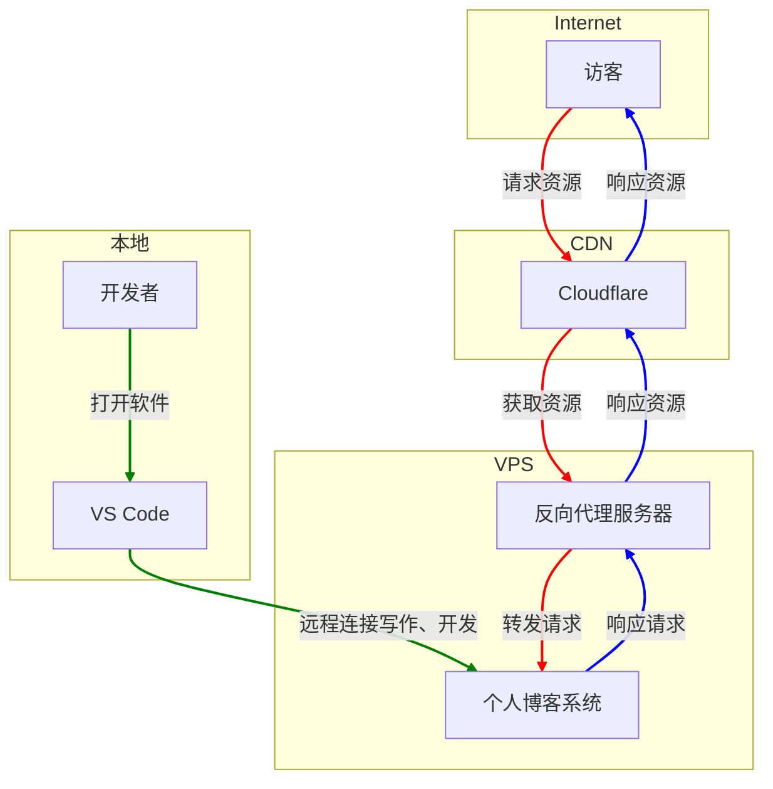

国内部署推荐采用腾讯云或阿里云服务器。

## 个人VPS部署流程图

```mermaid
graph TD
    subgraph "Internet"
        A[访客]
    end

    subgraph "CDN"
        B[Cloudflare]
        click B "https://cloudflare.com"
    end

    subgraph "VPS"
        C[反向代理服务器]
        D[个人博客系统]
    end

    subgraph "本地"
        E[VS Code]
        F[开发者]
    end

    A -- 请求资源 --> B
    B -- 获取资源 --> C
    C -- 转发请求 --> D

    D -- 响应请求 --> C
    C -- 响应资源 --> B
    B -- 响应资源 --> A

    F -- 打开软件 --> E
    E -- "远程连接写作、开发" --> D
   
    linkStyle 0 stroke-width:2px,fill:none,stroke:red;
    linkStyle 1 stroke-width:2px,fill:none,stroke:red;
    linkStyle 2 stroke-width:2px,fill:none,stroke:red;

    linkStyle 3 stroke-width:2px,fill:none,stroke:blue;
    linkStyle 4 stroke-width:2px,fill:none,stroke:blue;
    linkStyle 5 stroke-width:2px,fill:none,stroke:blue;

    linkStyle 6 stroke-width:2px,fill:none,stroke:green;
    linkStyle 7 stroke-width:2px,fill:none,stroke:green;
```